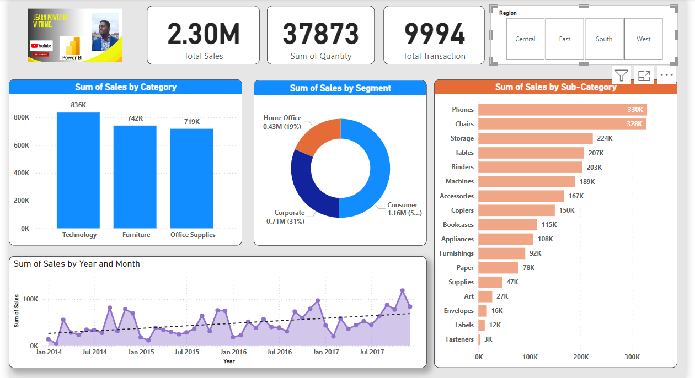

# Power-BI-Sales-Report 🚀
This Power-BI report visualises the sales of a company to answer questions asked by the management, the steps taken to build this is explained for easy understanding.

## Introduction 🎤
This is a report for the SuperStore dataset to show the Management top details from the data.

### Power BI Concepts Applied
 * Editing the canvas
 * Getting data from an Excel file
 * Cleaning and Transforming data in Power Query
 * Building visuals with Clustered Column chart, clustered bar chart, doughnut chart, Line Chart.
 * Editing interactions between visuals on a page.
 * Application of Slicers
 * Application of Card visuals.

---

## Problem Statement
What is the Total Sales by Region, Category, Sub-category and segment?
What is the number of transactions?
What is the quantity of items sold?
What is the total sales trend since 2014?

## Data Source
This project is built from the SuperStore Dataset that is freely available online.

## Data Cleaning and Transformation
The dataset is clean, I checked that the data types are correct and then loaded it into Power BI. This is the ETL step.

## Data Modelling
This data consists of just one table so there is nothing to model.

## Data Analysis and Visuals

